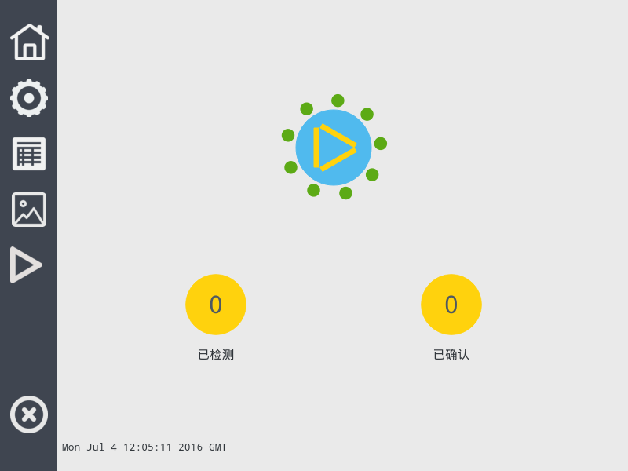
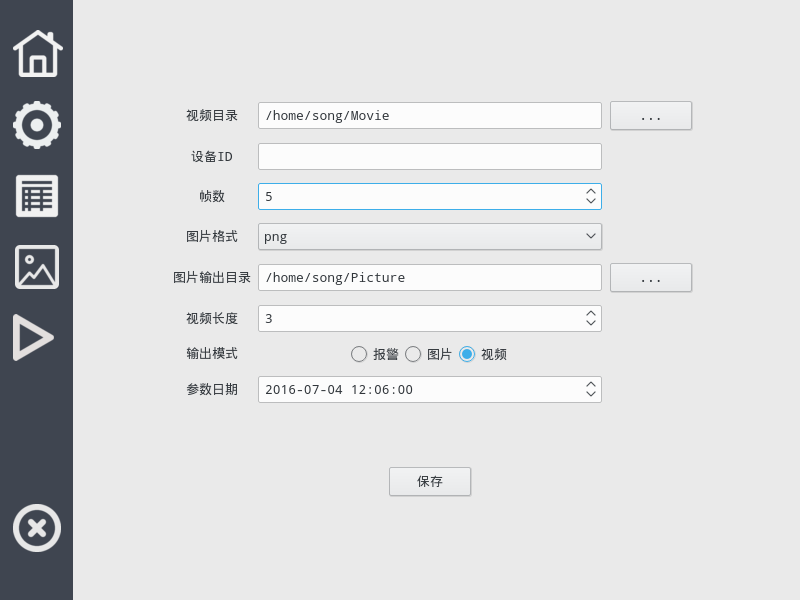
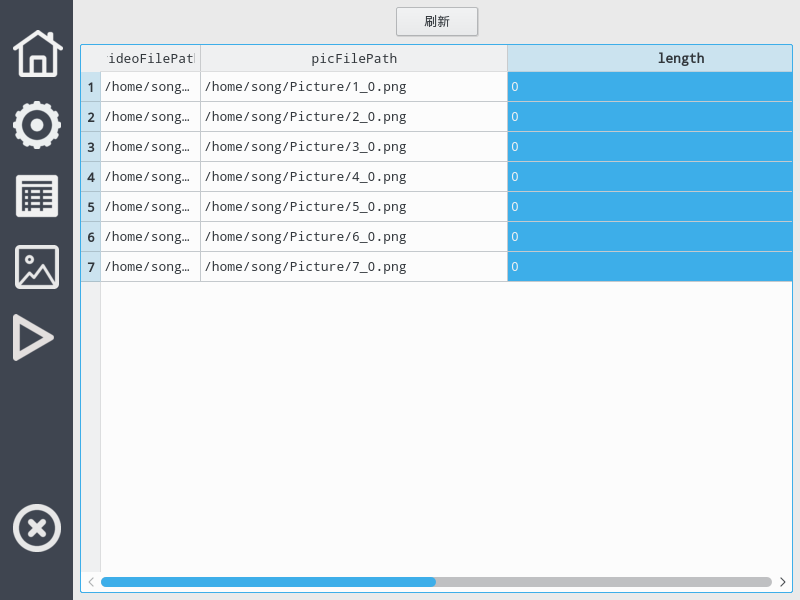
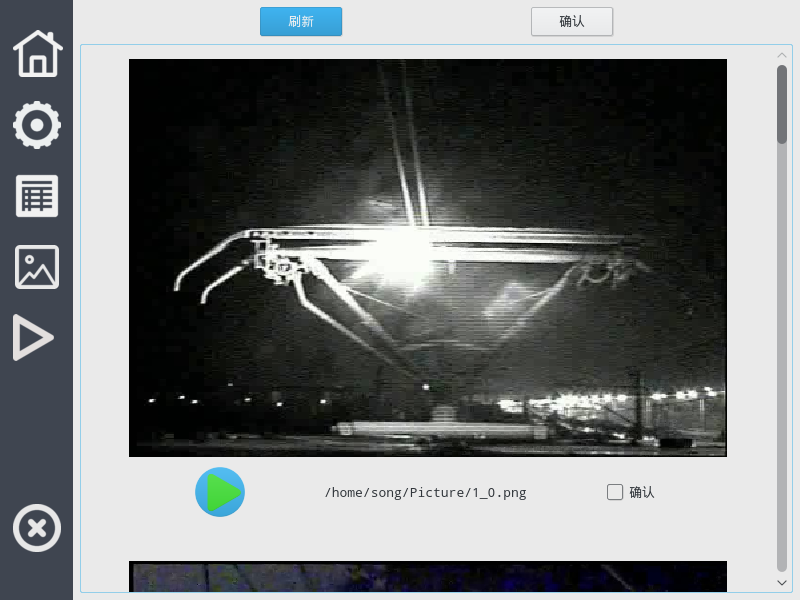
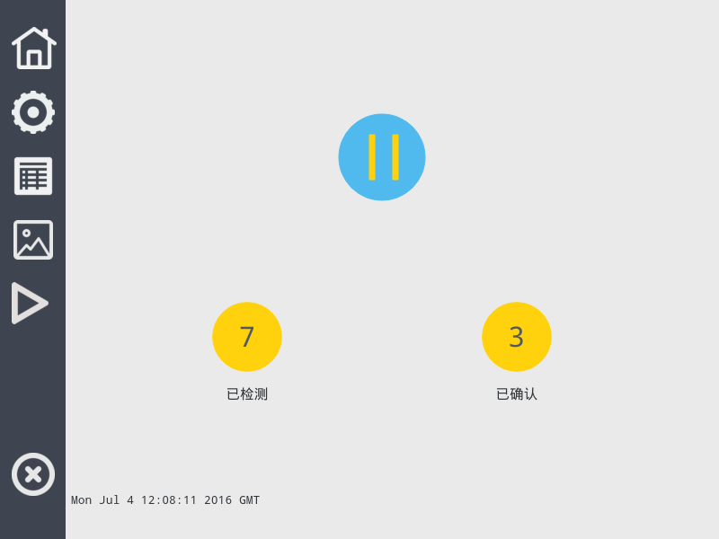
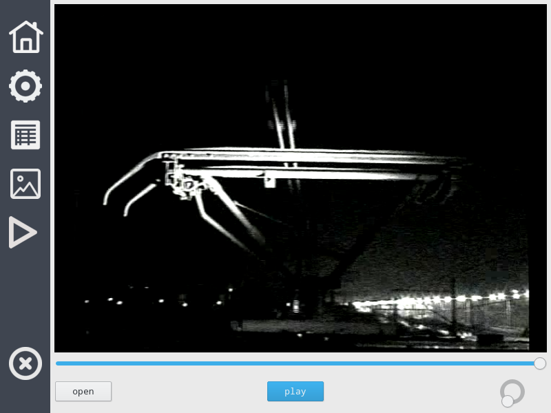

# 软件使用说明书

[TOC]

## 环境

- 操作系统 : ArchLinux
- 桌面 : KDE5
- IDE : Clion
- 界面 : Qt5.7
- DBMS : sqlite3

## 依赖

- Qt5.7
- cmake3.5
- sqlite3
- mpv

## 概述

​	软件使用了CMake对工程进行管理。此外Qt库自带的视频类播放功能较弱，因此嵌入了MPV视频播放器[MPV](https://mpv.io/) ，所以要安装MPV 播放器。IDE选用了智能的CLion，也可以使用同样基于CMake的Kdevelop打开工程。桌面环境最好使用KDE5，暂时还未在 Ubuntn gnome 环境下测试，可能界面会出现一些小问题。数据库使用的是轻量级的Sqlite3。

​	软件暂时还存在的一些问题：

- 数据库的字段与文档上的没有匹配
- 有一些设置参数还没有实现
- 算法里的一些参数还需要在程序中手动修改
- 可能会有一些未知的Bug

  ​上述的问题会在之后进行改进。此外现在对要处理的视频的一些具体参数还不太明确，比如接触网在视频中的大致那个位置，如果明确大致的位置，可以使用ROI将接触网部分截取出来，只对截取的部分进行分析（现在是对整个视频区处理），可以很大程度上增加程序的处理效率和判别的准确度。

## 使用说明

### 主页

 

​	左侧标签页进行导航，分别表示：主页 -> 设置界面 ->数据库查看界面 -> 确认界面 -> 截取视频查看界面 -> 退出界面。

​	主页界面共有三个主要控件：最上面的控件可以点击，用来控制后台算法的开始和停止。同时也可以通过显示状态：

 

 

 

上面三幅图表示三种状态，分别是暂停状态，运行状态，侦听状态。三种状态的特点是：

- 暂停状态：终止后台处理线程
- 运行状态：后台线程正在处理视频文件
- 侦听状态：后台线程已将文件处理完成，现在正在对文件夹进行侦听，如果文件夹中出现了新的视频则立刻进入处理状态。

### 设置界面

 

设置界面主要是对算法和软件进行设置，主要设置视频和图片的保存路径。必须注意的是，每次设置后一定要点击保存才能生效，以将设置保存到数据库中。

### 数据库界面

 

注意要点击上面的刷新

### 确认界面

 

在确认界面中会将预览截图，点击截图最下角的播放按钮会播放相对应的视频片段。如果通过预览确认电弧发生，则选中右下角的确认框，最后点击顶端的确认按钮。软件会将确认后的数据另存入一张数据库表。同时主界面的也会发生变化：

 

### 播放界面

 

播放界面后台使用MPV，将MPV嵌入软件的细节参见[Reference Manual](https://mpv.io/manual/stable/)。

